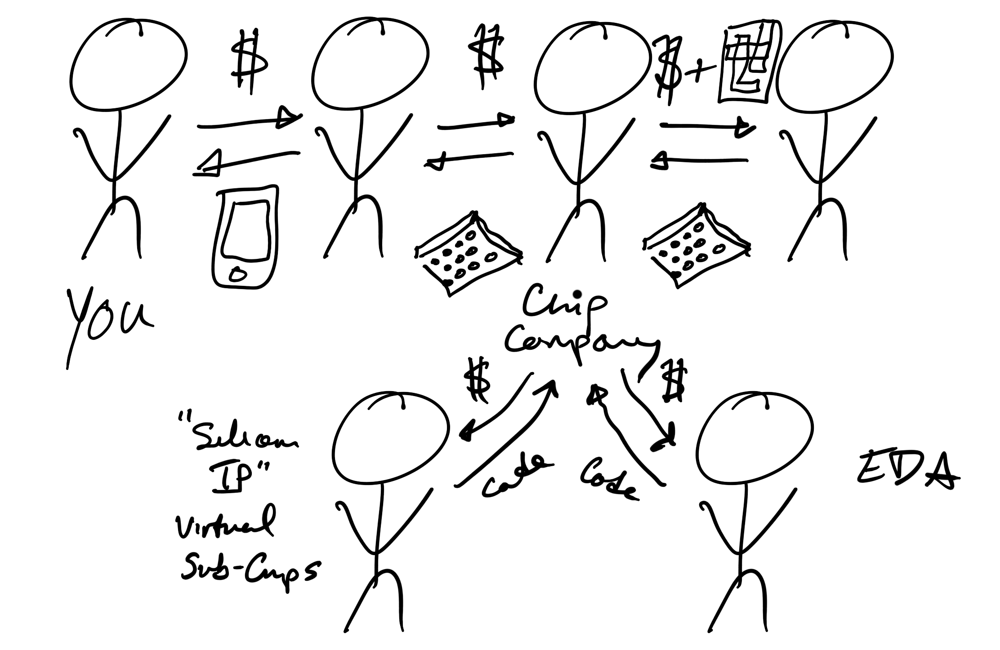

---

(backup)

---
<Invert>


</Invert>

---
<Invert>


</Invert>


---
<Invert>



</Invert>

---
### RISC-V vs [CPython](https://github.com/python/cpython/blob/master/Python/ceval.c)

<Split>

```verilog
module RISCVCPU (clock);
  // ...
  always @(posedge clock) 
    begin
      if ((opcode == LD) || (opcode == SD))
      begin
        ALUOut <= A + ImmGen; // compute effective address
        state <= 4;
      end
    else if (opcode == ALUop) begin
      case (IR[31:25]) // case for the various R-type instructions
        0: ALUOut <= A + B; // add operation
        default: ; // other R-type operations
      state <= 4;
    end
    else if (opcode == BEQ) begin
      if (A == B) begin
        PC <= ALUOut; // branch taken--update PC
        state <= 1;
      end
      else
      // ...
    end
  end
endmodule
```

```c 
PyObject * PyEval_EvalFrame(PyFrameObject *f) {
    PyObject **stack_pointer;  /* Next free slot in value stack */
    int opcode;        /* Current opcode */
    switch (opcode) {
      case TARGET(BINARY_OR): {
          PyObject *right = POP();
          PyObject *left = TOP();
          PyObject *res = PyNumber_Or(left, right);
          Py_DECREF(left);
          Py_DECREF(right);
          SET_TOP(res);
          if (res == NULL) goto error;
          DISPATCH();
      }
      case TARGET(LIST_APPEND): {
          PyObject *v = POP();
          PyObject *list = PEEK(oparg);
          int err;
          err = PyList_Append(list, v);
          Py_DECREF(v);
          if (err != 0) goto error;
          PREDICT(JUMP_ABSOLUTE);
          DISPATCH();
      }
      // ...
```

</Split>


