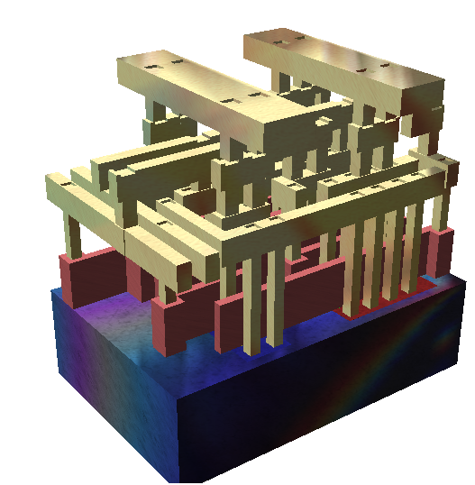
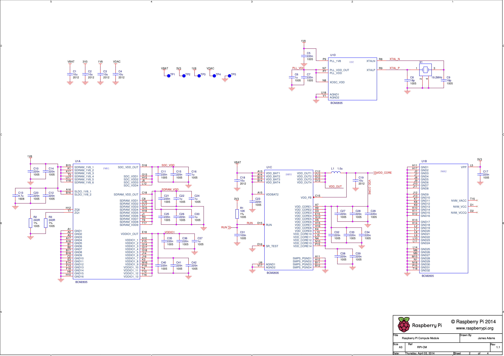
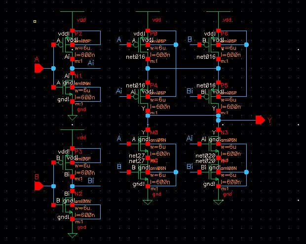
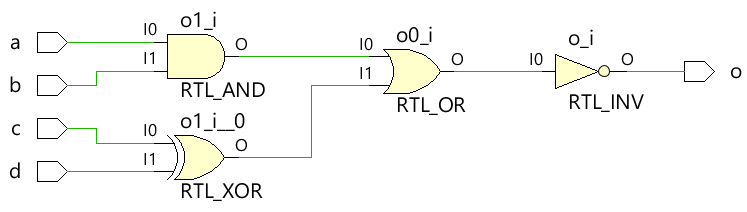
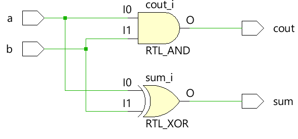
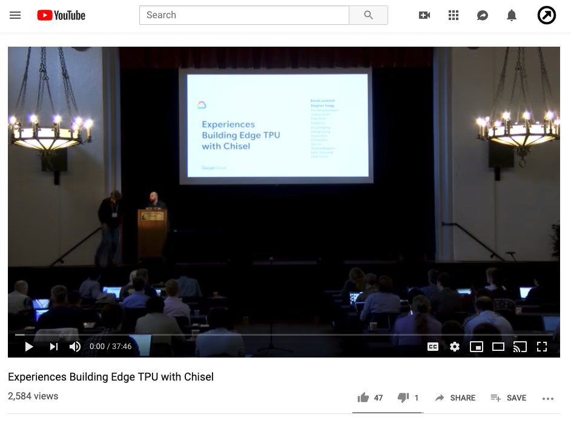
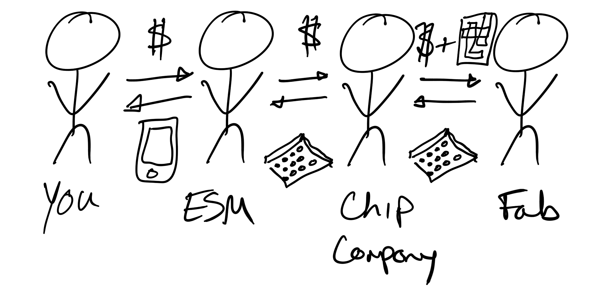
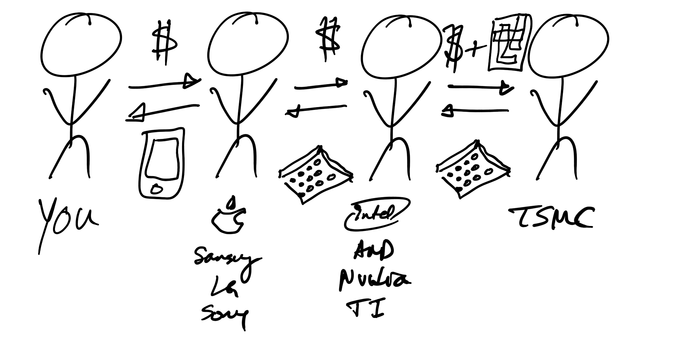
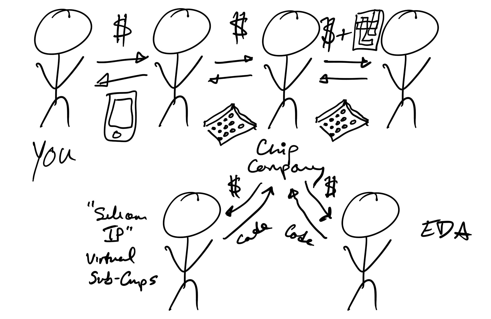

import { Notes } from 'mdx-deck'
import { Appear } from '@mdx-deck/components'
import { Image as BackgroundImage } from '@mdx-deck/components'
import { 
    Invert, Split, SplitRight, Horizontal, FullScreenCode, 
} from '@mdx-deck/layouts'
import { TwitterTweetEmbed } from 'react-twitter-embed';

import Image from './Image'
import Tweet from './Twitter'
import YouTube from './YouTube'
export { themes } from './themes'


[ChipsMadeFromPython.HW21.now.sh](https://chipsmadefrompython.hw21.now.sh)

---
## About Me
*  Apple Silicon 2009-19
* [hw21.io](https://hw21.io) 2019-??
* UC Berkeley 2020-??
* [@dan_fritchman](https://medium.com/@dan_fritchman)
* [medium.com/software-makes-hardware](https://medium.com/software-makes-hardware)

---

<BackgroundImage
  src='./img/die-photo-b.jpg'
  style={{
    display: 'flex',
    alignItems: 'center',
    justifyContent: 'center',
    flexDirection: 'column',
  }}>

## Chips Made<br/>From Python
### (Or, How Software<br/>Makes Hardware)

</BackgroundImage>

---
# Outline
* How Chips Get Designed 
* How Python (and Friends) Are Changing It

---
## People Making Software 
#### What does that look like? 

---
<BackgroundImage 
  src={"./img/silicon_valley.jpg"}
  style={{
    display: 'flex',
    alignItems: 'center',
    justifyContent: 'center',
    flexDirection: 'column',
  }} />

---
<BackgroundImage 
  src={"./img/alex-kotliarskyi-QBpZGqEMsKg-unsplash.jpg"}
  style={{
    display: 'flex',
    alignItems: 'center',
    justifyContent: 'center',
    flexDirection: 'column',
  }} />

---
## People Making *Silicon*
#### What does that look like? 

---
<YouTube id={"5zyjSBSvqPc"} />

---
<BackgroundImage 
  src={"./img/intel-bunnies.png"}
  style={{
    display: 'flex',
    alignItems: 'center',
    justifyContent: 'center',
    flexDirection: 'column',
  }} />

---
<YouTube id={"PJqbivkm0Ms"} />


---
<BackgroundImage 
  src={"./img/minority-report.jpg"}
  style={{
    display: 'flex',
    alignItems: 'center',
    justifyContent: 'center',
    flexDirection: 'column',
  }} />


---
<Appear>

#### (That Was A Trick Question)
#### Mostly, It's Code
#### Just Crappier 

</Appear>

---
### Software Abstraction Stack 

<Appear>

<div> 

#### High-Level Languages
#### C-ish-Level
#### Assembly 
#### Machine

</div> 

</Appear>

---
<Invert>

## Software Bedrock:<br/>Instructions

<Image src={"./img/instruct1.png"}/>

</Invert>

---
<Invert>

# Instructions

<Image src={"./img/instruct2.png"}/>

</Invert>

---
<Invert>

# Instructions

<Image src={"./img/instruct3.png"}/>

</Invert>

---
<Invert>

# Instructions

<Image src={"./img/instruct4.png"}/>

</Invert>

---
# Where Is<br/>*Hardware*<br/>Bedrock?

<Appear>

### Transistors?
### Electrons? 

</Appear>

---

## Hardware Bedrock
### Physical / Geometric


---
## Physical Layer
### Layout

<Image src={"./img/IcLayout.png"}/>

--- 

<Invert> 

## Physical Layer
### Layout & Cross Section 

<Image src={"./img/layout-xsection.png"}/>

</Invert> 

---
### Hardware Abstraction Stack 

<Appear>

<div>

#### "High-Level"
#### Behavioral
#### Structural 
#### Physical 

</div>

</Appear>

---
<Invert> 

## Structural Layer
### Schematics 



</Invert> 

---
## Structural Layer
### Schematics & HDLs

<Split>

<div>



</div>

<div>

```verilog
module my_first_module();  
  wire in[7:0], out[7:0];

  NAND_X8_FABTECH16 U0(out[0], in[0], in[1]);
  NOR_X4_FABTECH16 U1(out[1], in[1], in[2]);
  DFFR_X4_FABTECH16 U2(out[2], in[2], in[3], in[4]);
  BUFF_X2_FABTECH16 U3(out[3], in[3]);
  AOI_X4_FABTECH16 U4(out[4], in[3], in[4], in[5]);
  INV_X16_FABTECH16 U4(out[5], in[5]);
  INV_X16_FABTECH16 U5(out[5], in[5]);
  XOR_X2_FABTECH16 U6(out[6], in[5], in[6]);
  XNOR_X2_FABTECH16 U7(out[7], in[6], in[7]);

endmodule
```

</div>

</Split>

---
## Popular Hardware <br/> Description Languages <br/> (HDL)
### Verilog (1984)
### VHDL (1983)

---
## Behavioral HDL

```verilog
module RISCVCPU (clock);        // A RISC-V module excerpt 
	parameter LD = 7'b000_0011, 	// Instruction opcodes
		SD = 7'b010_0011, 
		BEQ = 7'b110_0011, 
		NOP = 32'h0000_0013, 
		ALUop = 7'b001_0011; 
	input clock;
	reg [63:0] PC; 
	// ... 

	integer i; 
	initial begin
		for (i=0; i<=31; i=i+1) Regs[i] = i;
	end

	always @(posedge clock) begin
		// Fetch & increment PC
		IFIDIR <= IMemory[PC >> 2];
		PC <= PC + 4;
		IDEXA <= Regs[IFIDrs1]; 
		IDEXB <= Regs[IFIDrs2]; 
		// ...
	end
	// ...
endmodule

```

---
## Behavioral Hardware<br/>Programming Patterns

<Appear>

<div>

### Reactive
### Event-Driven
### Async

</div>

</Appear>


---
## Reactive Pattern 

```
a = 1
b = 2
c = a + b 
```
```
c
```

<Appear> 

<div>

```
3
```

</div>

</Appear> 

---
## Reactive Pattern 

```
a = 1
b = 2
c = a + b 
a = 11
b = 22
```
```
c
```

<Appear> 

<div>

```
33
```

</div>

</Appear> 

---
## Reactive Pattern 

```verilog
module combinational (  
  input a, b, c, d, output  o);
 
  assign o = ~((a & b) | c ^ d);
 
endmodule
```

<Notes>

In an HDL, the reactive elements map pretty directly 
to combinational logic.

</Notes>

---
<Invert>

## Reactive Pattern 


</Invert>

---
## Reactive Pattern 

```verilog
module half_adder ( 
  input   a, b,
  output  sum, cout );
 
  assign sum  = a ^ b;
  assign cout = a & b;
endmodule
```

---
<Invert>

## Reactive Pattern 


</Invert>

---
## Event-Driven Pattern 

<Appear>

#### * Stuff Happens
#### * Some Code Runs in Response

</Appear>

---
## Event-Driven Pattern 

```verilog
module fsm ( /* ... */ ) 
  always @ (posedge clock or negedge reset)
    next_state = state;
    out = 0;
    case (state)
      A : 
        if (in) next_state = C;
        else next_state = B;
      B : 
        if (in) begin
          out = 1;
          next_state = C;
        end
      C : 
        if (~in) begin
          out = 1;
          next_state = B;
        end
      default : begin
          out = 1’bX;
          next_state = 3’bX;
        end
    endcase
  end
endmodule
```

--- 
## Async Pattern 

```python
import asyncio

async def f1():
    print("Step 1a")
    await asyncio.sleep(2)
    print("Step 3")
    
async def f2():
    print("Step 1b")
    await asyncio.sleep(1)
    print("Step 2")
    
asyncio.gather(f1(), f2())
```

<Appear> 

<div>

```
Step 1a
Step 1b
Step 2
Step 3
```

</div>

</Appear> 

--- 
## Async Pattern 

```verilog
module async_demo();

    initial begin
      $display("Step 1a")
      #2;
      $display("Step 3")
    end

    initial begin
      $display("Step 1b")
      #1;
      $display("Step 2")
    end

endmodule
```

<Appear> 

<div>

```
Step 1a
Step 1b
Step 2
Step 3
```

</div>

</Appear> 

--- 
## When Does This Code *Run?*

<Appear> 

### * Synthesis (Compiler)
### * Simulation 

</Appear>

---
## When Your<br/>Language Sucks

<Appear> 

### Some Coping Mechanisms
#### * New Career?
#### * Templating
#### * Code Generation 
#### * Replace It!

</Appear>

---
## Coping Mechanisms
### Templating 

```html
<html>
<body>



  <ul>
  
    <li><a href="{{ user.url }}">{{ user.username }}</a></li>
  
  </ul>


</body>
</html>
```

<Notes> 

Crappy Language
Better Language
Cripple it 
Embed it 
Run expander program, probably also in "good" language 
Get code out in crappy language  

</Notes>

---
## Coping Mechanisms
### Verilog Templating

```verilog
module example (/*AUTOARG*/);
  input i;
  output o;
  /*AUTOINPUT*/
  /*AUTOOUTPUT*/
  /*AUTOREG*/
  inst inst (/*AUTOINST*/);
  always @(/*AUTOSENSE*/) begin
    o = i;
  end
endmodule 
```

---
## Coping Mechanisms
### "Inverse" Templating:<br/>React / JSX

```jsx
const HigherOrderMePlz = ComponentClass => {
  return class extends Component {
    const { myProps, childProps } = this.props;
    render() {
      return (<MyWrapperStuff {...myProps}>
          <ComponentClass {...childProps}/>
        </MyWrapperStuff>);
    }
  };
};
```

<Notes>
Inverts Templating Relationship, 
placing the dumbed-down crap-language 
into the good language 
</Notes>

---
## "High Level" HDL
### Two Paths 

<Appear> 

#### * High-Level Synthesis
#### * Modern HDL

</Appear> 

---
## Modern HDL

<Appear>

### * High-Level SW Language
### * Domain-Specific Library 
### * (Most) Ditch HLS 
### * (Many) Ditch Event-Driven
### * (Mostly) from Academia

</Appear>

---
### [Chisel](https://chisel.eecs.berkeley.edu/)
#### Language: Scala
#### Authors: UC Berkeley

```scala
import chisel3._

class GCD extends Module {
  val io = IO(new Bundle {
    val a  = Input(UInt(32.W))
    val b  = Input(UInt(32.W))
    val e  = Input(Bool())
    val z  = Output(UInt(32.W))
    val v  = Output(Bool())
  })
  val x = Reg(UInt(32.W))
  val y = Reg(UInt(32.W))
  when (x > y)   { x := x -% y }
  .otherwise     { y := y -% x }
  when (io.e) { x := io.a; y := io.b }
  io.z := x
  io.v := y === 0.U
}
```

---
<Invert>

### [Chisel @ Google](https://www.youtube.com/watch?v=x85342Cny8c)
### Edge TPU



</Invert>

---
### [SpinalHDL](https://github.com/SpinalHDL/SpinalHDL)
#### Language: Scala

```scala
class AdderCell extends Component {
  val io = new Bundle {
    val a, b, cin = in Bool
    val sum, cout = out Bool
  }

  io.sum := io.a ^ io.b ^ io.cin
  io.cout := (io.a & io.b) | (io.a & io.cin) | (io.b & io.cin)
}

class Adder(width: Int) extends Component {
  
  // Create 2 AdderCell
  val cell0 = new AdderCell
  val cell1 = new AdderCell
  cell1.io.cin := cell0.io.cout   // Connect cout of cell0 to cin of cell1

  // Another example which create an array of ArrayCell
  val cellArray = Array.fill(width)(new AdderCell)
  cellArray(1).io.cin := cellArray(0).io.cout   // Connect cout of cell(0) to cin of cell(1)
}
```

---

### Where is the 
# Python?!?

---
### [MyHDL](http://www.myhdl.org/)
#### Language: Python

```python
from myhdl import block, Signal, delay, always, now

@block
def HelloWorld():

    clk = Signal(0)

    @always(delay(10))
    def drive_clk():
        clk.next = not clk

    @always(clk.posedge)
    def say_hello():
        print("%s Hello World!" % now())

    return drive_clk, say_hello


inst = HelloWorld()
inst.run_sim(50)
```

---
### [Migen](https://github.com/m-labs/migen) / [nMigen](https://github.com/m-labs/nmigen)
#### Language: Python

```python
class ORGate(Module):
  def __init__(self):
    self.a = Signal()
    self.b = Signal()
    self.x = Signal()
    self.comb += self.x.eq(self.a | self.b)

dut = ORGate()

def testbench():
  yield dut.a.eq(0)
  yield dut.b.eq(0)
  yield
  assert (yield dut.x) == 0

  yield dut.a.eq(0)
  yield dut.b.eq(1)
  yield
  assert (yield dut.x) == 1

run_simulation(dut, testbench())
```

---
### [Magma](https://github.com/phanrahan/magma)
#### Language: Python
#### Authors: Stanford

```python
import magma as m

class Adder(m.Circuit):
    name = "Adder{}".format(N)
    IO = ["I0", m.In(T), "I1", m.In(T), "CIN", m.In(m.Bit),
          "O", m.Out(T), "COUT", m.Out(m.Bit)]
    @classmethod
    def definition(io):
        adders = [mantle.FullAdder() for _ in range(N)]
        adders = m.fold(adders, foldargs={"CIN":"COUT"})
        COUT, O = adders(I0=io.I0, I1=io.I1, CIN=io.CIN)
        m.wire(O, io.O)
        m.wire(COUT, io.COUT)
```

---
### [PyMtl](https://github.com/cornell-brg/pymtl)
#### Language: Python
#### Authors: Cornell

```python
from pymtl import *

class RegIncr( Model ):
  def __init__( s ):

    s.in_ = InPort ( Bits(8) )
    s.out = OutPort ( Bits(8) )
    s.reg_out = Wire( Bits(8) )
  
    @s.tick
    def block1():
      if s.reset:
        s.reg_out.next = 0
      else:
        s.reg_out.next = s.in_

    @s.combinational
    def block2():
      s.out.value = s.reg_out + 1
```

---
### [Clash](https://clash-lang.org/)
#### Language: Haskell

```haskell
module MAC where

import Clash.Prelude

ma acc (x,y) = acc + x * y

macT acc (x,y) = (acc',o)
  where
    acc' = ma acc (x,y)
    o    = acc

mac = mealy macT 0

topEntity
  :: Clock System Source
  -> Reset System Asynchronous
  -> Signal System (Signed 9, Signed 9)
  -> Signal System (Signed 9)
topEntity = exposeClockReset mac
```

---
## Why Care?

<Appear> 

### * End of "Moore's Free Lunch"
### * Accelerators
### * FPGA 
### * RISC-V

</Appear> 

---
## Take-Aways

<Appear> 

### * We're not so different
### * HW is (increasingly) doable 
### * Face it, it's cool 

</Appear>

<Notes>
Doable on two lines:
Programming paradigms are familiar
Languages/ libs are catching up 
</Notes>

---

[medium.com/software-makes-hardware](https://medium.com/software-makes-hardware)

---

---

(backup)

---
<Invert>



</Invert>

---
<Invert>



</Invert>


---
<Invert>



</Invert>

---
### RISC-V vs [CPython](https://github.com/python/cpython/blob/master/Python/ceval.c)

<Split>

```verilog
module RISCVCPU (clock);
  // ...
  always @(posedge clock) 
    begin
      if ((opcode == LD) || (opcode == SD))
      begin
        ALUOut <= A + ImmGen; // compute effective address
        state <= 4;
      end
    else if (opcode == ALUop) begin
      case (IR[31:25]) // case for the various R-type instructions
        0: ALUOut <= A + B; // add operation
        default: ; // other R-type operations
      state <= 4;
    end
    else if (opcode == BEQ) begin
      if (A == B) begin
        PC <= ALUOut; // branch taken--update PC
        state <= 1;
      end
      else
      // ...
    end
  end
endmodule
```

```c 
PyObject * PyEval_EvalFrame(PyFrameObject *f) {
    PyObject **stack_pointer;  /* Next free slot in value stack */
    int opcode;        /* Current opcode */
    switch (opcode) {
      case TARGET(BINARY_OR): {
          PyObject *right = POP();
          PyObject *left = TOP();
          PyObject *res = PyNumber_Or(left, right);
          Py_DECREF(left);
          Py_DECREF(right);
          SET_TOP(res);
          if (res == NULL) goto error;
          DISPATCH();
      }
      case TARGET(LIST_APPEND): {
          PyObject *v = POP();
          PyObject *list = PEEK(oparg);
          int err;
          err = PyList_Append(list, v);
          Py_DECREF(v);
          if (err != 0) goto error;
          PREDICT(JUMP_ABSOLUTE);
          DISPATCH();
      }
      // ...
```

</Split>


