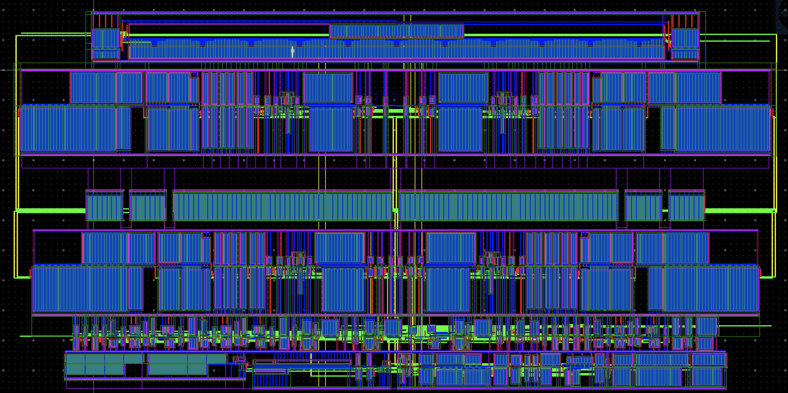
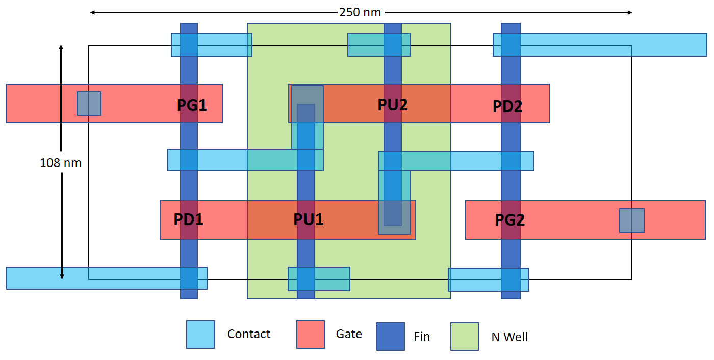
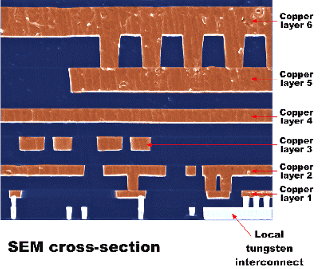

import { Notes } from 'mdx-deck'
import future from '@mdx-deck/themes/future'
import { 
    Image, Appear
} from '@mdx-deck/components'
import { 
    Invert, Split, SplitRight, Horizontal, FullScreenCode, 
} from '@mdx-deck/layouts'
import { TwitterTweetEmbed } from 'react-twitter-embed';

import syntax from './syntax'
import Layout from './layout'

export const themes = [
  future,
  syntax
]

---

<Image
  src='./img/die-photo-b.jpg'
  style={{
    display: 'flex',
    alignItems: 'center',
    justifyContent: 'center',
    flexDirection: 'column',
  }}>

## How Software<br/>Makes Hardware
### (Or, Chips Made<br/>From Python) 

</Image>

---

## About Me 
### Dan Fritchman
### [hw21.io](hw21.io)
* Apple Silicon 2009-19
* HW21 2019-??
* UC Berkeley 2020-??

---
# Outline
* How Chips Get Designed 
* How Python (and Friends) Are Changing It

---
# Software Making 
* What does that look like? 

(photo: office, people writing code, etc )

---
# Chip Making 
* What does that look like? 

* Clean room?
* 3D?
* Minority Report? 

---

> Design and programming are human activities;<br/> 
> forget that and all is lost.

Bjarne Stroustrup, Father of C++


---
### Software Abstraction Stack 

<Appear>

#### High-Level Languages
#### C-ish-Level
#### Assembly 
#### Machine

</Appear>

---
## Software Bedrock:<br/>Instructions

<div className="centerContent">
<div className="selfCenter">
<TwitterTweetEmbed tweetId="1114789468886663169" />
</div>
</div>

---
# Instructions

<div className="centerContent">
<div className="selfCenter">
<TwitterTweetEmbed tweetId="1112626274625740801" />
</div>
</div>

---
# Instructions

<div className="centerContent">
<div className="selfCenter">
<TwitterTweetEmbed tweetId="1101276995738992641" />
</div>
</div>

---
# Instructions

<div className="centerContent">
<div className="selfCenter">
<TwitterTweetEmbed tweetId="1097358836640362496" />
</div>
</div>

---
# Where Is<br/>Hardware<br/>Bedrock?

<Appear>

### Transistors?
### Electrons? 

</Appear>

---

## Hardware Bedrock
### Physical / Geometric


---
## Physical Layer
### Layout


--- 
## Physical Layer
### Layout & Cross Section 

<Split>





</Split>


---
### Hardware Abstraction Stack 

#### "High-Level"
#### Behavioral
#### Structural 
#### Physical 

---
## Structural Layer
### Schematics & HDLs

<Split>

<div>


</div>

<div>

```verilog
module my_first_module();  
  wire in[7:0], out[7:0];

  NAND_X8_FABTECH16 U0(out[0], in[0], in[1]);
  NOR_X4_FABTECH16 U1(out[1], in[1], in[2]);
  DFFR_X4_FABTECH16 U2(out[2], in[2], in[3], in[4]);
  BUFF_X2_FABTECH16 U3(out[3], in[3]);
  AOI_X4_FABTECH16 U4(out[4], in[3], in[4], in[5]);
  INV_X16_FABTECH16 U4(out[5], in[5]);
  INV_X16_FABTECH16 U5(out[5], in[5]);
  XOR_X2_FABTECH16 U6(out[6], in[5], in[6]);
  XNOR_X2_FABTECH16 U7(out[7], in[6], in[7]);

endmodule
```

</div>

</Split>

---
## Hardware Description Language (HDL)
### Verilog (1984)
### VHDL (1983)

---
## Behavioral HDL

```verilog
module RISCVCPU (clock);        // A RISC-V module excerpt 
	parameter LD = 7'b000_0011, 	// Instruction opcodes
		SD = 7'b010_0011, 
		BEQ = 7'b110_0011, 
		NOP = 32'h0000_0013, 
		ALUop = 7'b001_0011; 
	input clock;
	reg [63:0] PC; 
	// ... 

	integer i; 
	initial begin
		for (i=0; i<=31; i=i+1) Regs[i] = i;
	end

	always @(posedge clock) begin
		// Fetch & increment PC
		IFIDIR <= IMemory[PC >> 2];
		PC <= PC + 4;
		IDEXA <= Regs[IFIDrs1]; 
		IDEXB <= Regs[IFIDrs2]; 
		// ...
	end
	// ...
endmodule

```
---
### RISC-V vs [CPython](https://github.com/python/cpython/blob/master/Python/ceval.c)

<Split>

```verilog
module RISCVCPU (clock);
  // ...
  always @(posedge clock) 
    begin
      if ((opcode == LD) || (opcode == SD))
      begin
        ALUOut <= A + ImmGen; // compute effective address
        state <= 4;
      end
    else if (opcode == ALUop) begin
      case (IR[31:25]) // case for the various R-type instructions
        0: ALUOut <= A + B; // add operation
        default: ; // other R-type operations
      state <= 4;
    end
    else if (opcode == BEQ) begin
      if (A == B) begin
        PC <= ALUOut; // branch taken--update PC
        state <= 1;
      end
      else
      // ...
    end
  end
endmodule
```

```c 
PyObject * PyEval_EvalFrame(PyFrameObject *f) {
    PyObject **stack_pointer;  /* Next free slot in value stack */
    int opcode;        /* Current opcode */
    switch (opcode) {
      case TARGET(BINARY_OR): {
          PyObject *right = POP();
          PyObject *left = TOP();
          PyObject *res = PyNumber_Or(left, right);
          Py_DECREF(left);
          Py_DECREF(right);
          SET_TOP(res);
          if (res == NULL) goto error;
          DISPATCH();
      }
      case TARGET(LIST_APPEND): {
          PyObject *v = POP();
          PyObject *list = PEEK(oparg);
          int err;
          err = PyList_Append(list, v);
          Py_DECREF(v);
          if (err != 0) goto error;
          PREDICT(JUMP_ABSOLUTE);
          DISPATCH();
      }
      // ...
```

</Split>

---
## Hardware Programming Patterns

<Appear>

### Reactive
### Event-Driven

</Appear>

---
## Reactive Pattern 

observable notebook, etc 

---
## Event-Driven Pattern 

stuff happens, and other things react to it 

---
# How Sucky Can it Be?
### Or, Things *Not* To Take For Granted
* Custom Types
* Package Management 
* Namespaces 

---
# When Your Language Sucks
## Some Coping Mechanisms
<Appear> 

### * Lower Your Expectations
### * New Career?
### * Templating
### * Code Generation 
### * Replace It!

</Appear>

---
## Coping Mechanisms
### Templating 

```html


  <ul>
  
    <li><a href="{{ user.url }}">{{ user.username }}</a></li>
  
  </ul>

```

---
## Coping Mechanisms
### Templating 

Crappy Language
Better Language
Cripple it 
Embed it 
Run expander program, probably also in "good" language 
Get code out in crappy language  


---
# Coping Mechanisms
## React & JSX

```jsx
class SuperCoolComponent extends React.Component {
  render() {
    return (
      <p>code slide works in markdown too whaaaaat</p>
    );
  }
}
```
<Notes>
Inverts Templating Relationship, 
placing the dumbed-down crap-language 
into the good language 
</Notes>

---
## Modern HDL
### Two 

---
<FullScreenCode>

```python
def foo():
  pass
```
</FullScreenCode>

