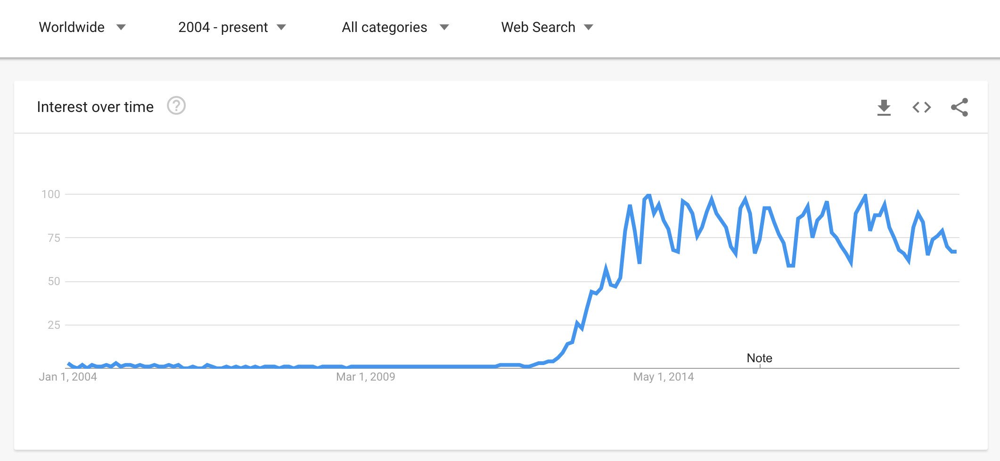
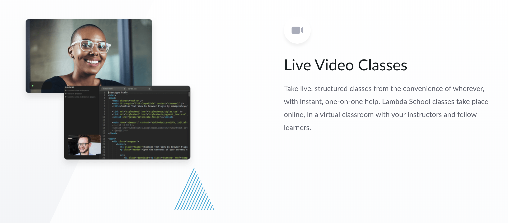

import future from '@mdx-deck/themes/future'
import highlight from '@mdx-deck/themes/syntax-highlighter'

export const themes = [
  future,
  highlight
]

import { 
    Image, Appear
} from '@mdx-deck/components'

import { 
    Invert, Split, SplitRight, Horizontal, FullScreenCode, 
} from '@mdx-deck/layouts'

---
# KlassLive

* Live, fun teaching & learning. 
* Built with Jupyter. 
* For sessions just like this. 

---
## About Me
* Apple 2009-19
* hw21.io 2019-??
* Berkeley 2020-??
* [fritch.mn](http://fritch.mn)
* [medium.com/@dan_fritchman](https://medium.com/@dan_fritchman)

---
<Image
  src='https://source.unsplash.com/-8atMWER8bI/680x400'
  style={{
    display: 'flex',
    alignItems: 'center',
    justifyContent: 'center',
  }}>

## Teaching<br/>&<br/>Learning 

</Image>

---
## Teaching & Learning
* Traditional Classroom
    * Highly immersive. Live there for years. 
* Lifelong
* MOOC
* Live


--- 
<Invert>

# MOOCs


</Invert>

--- 
<Invert>

# MOOCs


</Invert>

---
# Artisinal <br/> Farm to Table <br/> Teaching & Learning

## Personal 
## Interactive 
## Live! 

---
# *Live* <br/>  Teaching & Learning

### * some benefits
### * people showed up here, in this room 
### * lambda school, etc 

---
<Invert>

# Example: <br/> Lambda School 



</Invert>

---
# *Live* <br/>  Teaching & Learning
## Some Options

#### * Slides
#### * Live Code
#### * Notebook

---
## Slides

No interactivity

---
<Split>


## Live <br/> Coding
### Or, Live <br/> Copy-Paste
</Split>

---

# *Interactive* <br/> Teaching & Learning

--- 
<Image
  src='./img/install.gif'
  style={{
    display: 'flex',
    alignItems: 'center',
    justifyContent: 'center',
  }}>

## How to Interact

## Step 1: Installation!

</Image>

---
## Jupyter 
* Sharing: Good
* Setup: Depends
* Participation: None

---
# Some Problems
* Setup & Installation
* Keeping Up
* Fun! 

---
# Setup & Installation Fun 
C++ libs, crazy setup etc. 

---
# Keeping Up

```python
def stage1(monkey):
    """ Write a function that turns a monkey into a wrench. """
    return ...
```

---
<FullScreenCode>

```python
def stage2(monkey):
    """ Write a function that 
    uses stage 1 
    to turn a monkey 
    into a whole garage. """
    wrench = stage1(monkey)
    return ...
```

</FullScreenCode>

---
# Keeping Up

```python
def stage73(monkey):
    """ Write a function that uses stages 1-72,
    to recreate the origins of the universe. """
    wrench = stage1(monkey)
    return ...
```

Once any of stages 1-72 go wrong,
you're done. 

---
# Some Inspiration
* Interviewing
    * CoderPad
    * CodeBunk
* Challenges
    * foo.bar
    * Advent of Code 
* Web Environments
    * repl.it 
    * CodePen
    * CodeSandbox
* Jupyter
* Binder

---
# KlassLive 
* Zero Installation
* Always Live 
* Built on Jupyter 

---
# Demo?

---
# Problems
* Every Problem Has:
    * Setup
    * Prompt
    * Solution(s)
    * Tests
* Tests run on server, in Klass container

--- 
# Scoring 
* Pass / Fail
* Manual Scoring 
* Scoring API

---
# Execution
* Jupyter Goal-Fight: Interactive vs Reproducible 
* Always runs "all cells above", plus tests 

---
# Scoreboard

---
# Export 
* Binder-Compatible GitHub Repo
* Jupyter Notebook + Env Setup 
* FIXME: how to point to existing container image? 

---
# Tech Stack
* React 
* GraphQL
* Firebase 
* OpenFAAS? GKE?


---
